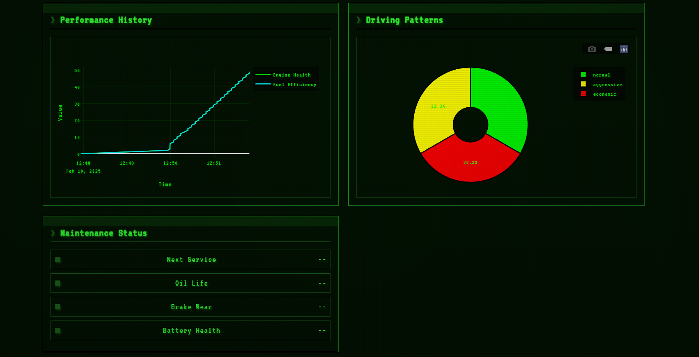

# RetroTech Auto Analytics

A sophisticated vehicle analytics platform that combines modern machine learning with retrofuturistic aesthetics. This project demonstrates the integration of real-time diagnostics, predictive analytics, and an engaging user interface inspired by synthwave design principles.

## Interface Screenshots

Experience the retro-futuristic interface of RetroTech Auto Analytics:


*Main Dashboard - Real-time vehicle telemetry with retro CRT display effects*


*Performance Analytics Panel - Monitoring engine health and efficiency scores*


*System Diagnostics View - Advanced vehicle diagnostics with classic terminal aesthetics*

## Project Overview

RetroTech Auto Analytics transforms conventional vehicle diagnostics into an innovative monitoring system that features:

- Real-time vehicle telemetry with advanced data visualization
- Machine learning-powered predictive maintenance
- Retrofuturistic user interface with modern functionality
- Comprehensive performance metrics and analytics
- Intelligent maintenance scheduling and alerts

## Technical Architecture

The project leverages a robust technology stack:
- Backend: Python with Flask framework
- Frontend: HTML5/CSS3/JavaScript with modern design patterns
- Data Analysis: NumPy, Pandas, Scikit-learn for analytics
- Visualization: Plotly for interactive data representation
- Styling: Custom CSS implementing retrofuturistic design principles

## Implementation Guide

### Production Deployment
Access the live implementation at [RetroTech Auto Analytics](https://retrotech-auto-analytics.onrender.com)
```
Authentication Credentials:
Username: demo
Password: demo123
```

### Docker Implementation
```bash
# Repository Clone
git clone https://github.com/aevyy/RetroTech-Auto-Analytics.git
cd RetroTech-Auto-Analytics

# Docker Deployment
docker-compose up
```
Access the application at http://localhost:5000

### Local Development Environment
```bash
# Repository Clone
git clone https://github.com/aevyy/RetroTech-Auto-Analytics.git
cd RetroTech-Auto-Analytics

# Environment Configuration
python -m venv venv
source venv/bin/activate  # Windows: venv\Scripts\activate

# Dependency Installation
pip install -r requirements.txt

# Application Launch
python main.py
```

## Core Functionality

### 1. Vehicle Configuration
- Comprehensive vehicle parameter customization
- Adaptive analytics based on vehicle specifications

### 2. Real-time Monitoring
- Engine telemetry visualization
- Performance metric analysis
- System status monitoring

### 3. Predictive Analytics
- Machine learning-based pattern recognition
- Predictive maintenance algorithms
- Health trend analysis

### 4. Maintenance Management
- Scheduled maintenance tracking
- Component health monitoring
- Preventive maintenance recommendations

## Hardware Integration

### OBD-II Implementation
Required Components:
- ELM327 OBD-II interface (Bluetooth/USB)
- Vehicle compatibility: 1996 or newer models

Configuration Process:
1. Interface connection to OBD-II port
2. System connectivity establishment
3. Data acquisition initiation

Note: A simulation mode is available for development and demonstration purposes.

## Support and Resources

Technical Assistance:
- Email: support@retrotech-analytics.com
- Documentation: [RetroTech Community](https://discord.gg/retrotech)
- Updates: [@RetroTechAuto](https://twitter.com/RetroTechAuto)

## Development Contributions

We welcome collaborative development efforts. Please refer to [CONTRIBUTING.md](CONTRIBUTING.md) for contribution guidelines and best practices.

## License Information

This project is distributed under the MIT License - see [LICENSE](LICENSE) for detailed terms.

## Development Roadmap

Planned Enhancements:
- OBD-II data integration optimization
- Advanced machine learning model implementation
- Enhanced predictive analytics
- Market value analysis integration
- Inventory management system
- Historical data analysis enhancement

## Technical Specifications

Interface Features:
- Retrofuturistic design implementation
- CRT display simulation
- Real-time data synchronization
- Responsive interface design
- Interactive data visualization

## Implementation Insights

This project demonstrates proficiency in:
- Full-stack application architecture
- Machine learning implementation
- Real-time data processing
- Modern UI/UX design principles
- Automotive systems integration
- Complex system simplification

For inquiries or collaboration opportunities, please refer to the contact information provided above. 